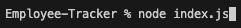
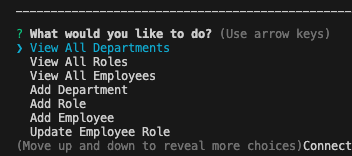
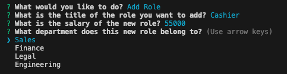

# Employee Tracker

## Description

Employee Tracker is an application that runs in the terminal. It allows the user to display information on their employees, as well as add employees, roles and departments.

## Installation

Installation of Node.js is required to run this module. Additionally, The node packages inquirer version 8.2.4, dotenv, mysql2 must be installed.

## Usage

To start using the Employee Tracker, enter the command 'node index.js' into the Terminal. 

Then use the arrow keys to make the desired selection. After that, either navigate to the next desired option, or answer the questions as they prompt.

A video demonstration can be found at this link: https://drive.google.com/file/d/1RTl2ph-XE139FwStpsBb_pKNm3GvLo1g/view.

## Credits

Thanks goes to the University of Minnesota and Edx Bootcamp for providing the assistance needed to complete this project. I also would like to thank J. Bittner for assistance with the Employee Tracker ascii logo.

## License

MIT License

Copyright (c) 2024 helm0127

Permission is hereby granted, free of charge, to any person obtaining a copy
of this software and associated documentation files (the "Software"), to deal
in the Software without restriction, including without limitation the rights
to use, copy, modify, merge, publish, distribute, sublicense, and/or sell
copies of the Software, and to permit persons to whom the Software is
furnished to do so, subject to the following conditions:

The above copyright notice and this permission notice shall be included in all
copies or substantial portions of the Software.

THE SOFTWARE IS PROVIDED "AS IS", WITHOUT WARRANTY OF ANY KIND, EXPRESS OR
IMPLIED, INCLUDING BUT NOT LIMITED TO THE WARRANTIES OF MERCHANTABILITY,
FITNESS FOR A PARTICULAR PURPOSE AND NONINFRINGEMENT. IN NO EVENT SHALL THE
AUTHORS OR COPYRIGHT HOLDERS BE LIABLE FOR ANY CLAIM, DAMAGES OR OTHER
LIABILITY, WHETHER IN AN ACTION OF CONTRACT, TORT OR OTHERWISE, ARISING FROM,
OUT OF OR IN CONNECTION WITH THE SOFTWARE OR THE USE OR OTHER DEALINGS IN THE
SOFTWARE.
